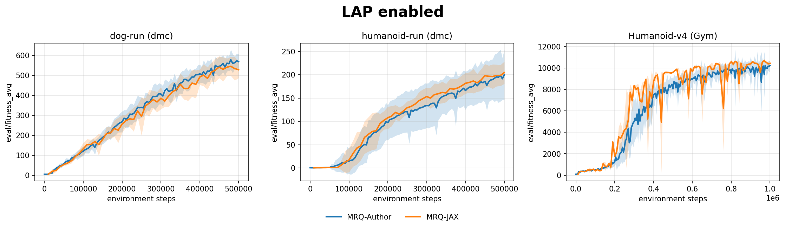
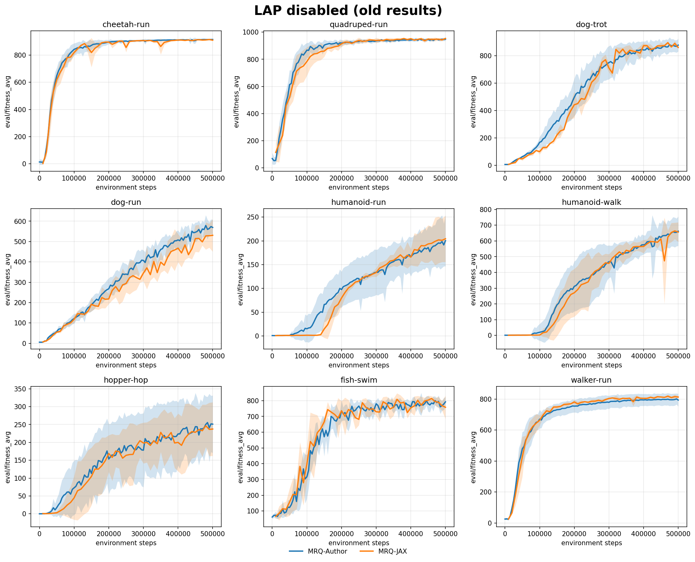

# MRQ-JAX

JAX re-implementation of **MR.Q: Towards General-Purpose Model-Free Reinforcement Learning**.

Paper: https://arxiv.org/abs/2501.16142

Kaggle setup: https://www.kaggle.com/code/therealtin/public-mrq-jax

## Status

Not implemented:

* Image observations
* Discrete actions

## Results
New results



Old results (before implementing LAP)



## Installation

```bash
conda create -n mrq-jax python=3.10
conda activate mrq-jax

pip install -r requirements.txt
pip install -e .
```

## Training

Example:

```bash
python3 main.py env.env_name=humanoid-run env.backend=dmc
python3 main.py env.env_name=HalfCheetah-v4 env.backend=gymnasium mrq.episodic=true
python3 main.py env.env_name=h1-sit_simple env.backend=humanoid-bench mrq.episodic=true
```

## Acknowledgements

This implementation is inspired by:

* https://github.com/adaptive-intelligent-robotics/QDax
* https://github.com/ShaneFlandermeyer/tdmpc2-jax

Some code structure and implementation details follow ideas from these projects.